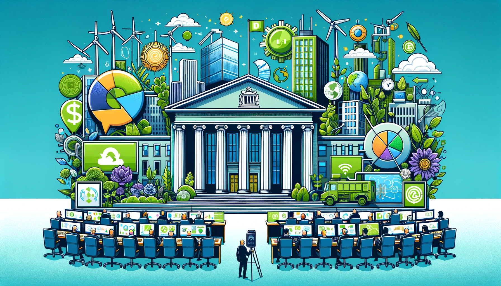

- [Name of the Project Leader](#name-of-the-project-leader)
- [Title of the Project](#title-of-the-project)
- [Outline of the Project](#outline-of-the-project)
- [Brief Description of Work](#brief-description-of-work)
- [Intended Learning Outcomes and Work Benefits](#intended-learning-outcomes-and-work-benefits)
- [Number of Vacant Positions](#number-of-vacant-positions)
- [Total Hours](#total-hours)
- [Hours per Position](#hours-per-position)
- [Start Date](#start-date)
- [End Date](#end-date)
- [Who can apply?](#who-can-apply)
- [Required Skills](#required-skills)
- [Desired Skills](#desired-skills)

---

<small></small>
<small>This illustration brings together the concepts of financial market dynamics, monetary policy, central banking, and environmental sustainability.</small>

#### Name of the Project Leader

Fatih Kansoy

#### Title of the Project

Empirical Finance: Central Bank Studies

#### Outline of the Project

The era of one policy objective –inflation targeting– and one tool – interest rates – is over for the central banks for the sake of financial stability. Today, there are many challenges that central banks have to face and climate crisis is at the top of the list. To deliver financial stability in a world that is now so financially interconnected poses fresh challenges such as climate risk and recent pandemic which affects the two policy goals pursued by central banks, financial and monetary stability. Central banks need to not just adapt to changing conditions but equip new tools too.

Apart from macroprudential tool central banks has another powerful tool: communication. Communication has become as important financial monitoring and management to effective central bank operations. If done well, communication can strengthen understanding of central bank objectives by market agent as well as public, help shape the market mood and provide reassurance in times of stress.

In this project, we are going to check and rank the communication channel and efficiency of central banks climate change policy over the world. Since, an effective communication can help to shape the view of public and increase the policy effectiveness. In this regard, for example, the Guardian newspaper has recently changed their language on climate matters, and they no longer use "climate change" but "climate crisis” since it is a crisis, not a change. In a similar manner, by using natural language processing method, we are going to rank the central bank according to their sensitivity of this issue.

#### Brief Description of Work

- Collection of texts from central bank publications globally.
- Data cleaning and processing for dataset preparation.
- Analysis of complex datasets with reporting software and Python.
- Data collection and cleaning responsibilities.
- Interpretation and analysis for clear data visualizations.
- Experience with NLP tools like TensorFlow or PyTorch is advantageous.

#### Intended Learning Outcomes and Work Benefits

- First-hand understanding of academic research conduction.
- Overview of macroeconomic research methods.
- Reinforcement of data process importance from collection to analysis.
- Rigorous practical experience in financial data techniques for academic publishing.

#### Number of Vacant Positions

1 or 2

#### Total Hours

150

#### Hours per Position

75 or 150

#### Start Date

January 2024

#### End Date

September 2024

#### Who can apply?

- BSc Economics, BSc Economics and Industrial Organisation, BSc/BA EPAIS, BSc Mathematics and Economics (Y2/Y3)
- MSc Economics, MSc Economics and International Financial Economics, MSc Behavioural and Economic Science

#### Required Skills

- Python and/or STATA programming.
- MS Excel proficiency.

#### Desired Skills

- SQL knowledge.
- HTML and Selenium experience.
