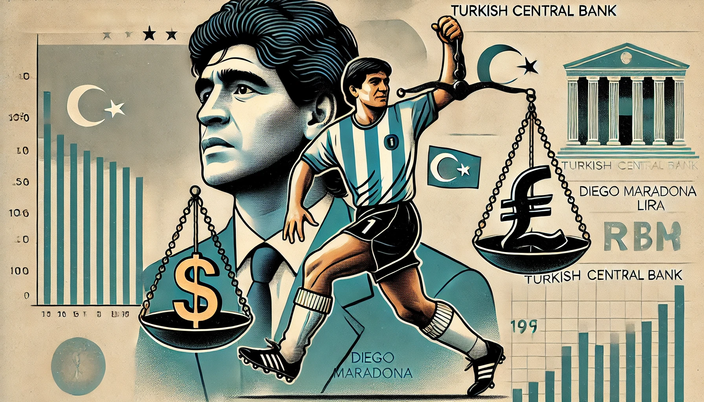

## Is the Turkish Central Bank the Maradona of Monetary Policy?

Diego Maradona's 1986 World Cup match against England is etched into football folklore, not just for its drama but for the two iconic goals he scored—each as different as night and day. One was the infamous "Hand of God," a cheeky, rule-bending act that somehow fooled the referee. The other was a masterpiece, as [Maradona sliced through the English defense with a 60-meters sprint](https://www.youtube.com/embed/Da_CDPRG2j0?si=1lI8ImoU0skfWVis&amp;start=50), straight as an arrow, gliding past five bewildered players who braced for feints that never came. His run was legendary, and his tactics were unpredictable—just like modern central banking.

And when it comes to recent Turkish monetary policy, it’s hard not to see a reflection of this Maradona magic: a tale of missteps and misdirection, followed by a disciplined, strategic sprint. For years, Turkey’s central bank was locked in an unconventional approach—akin to Maradona’s first goal—trying to bend the rules of economic orthodoxy. President Erdoğan’s insistence that high interest rates cause inflation (rather than curb it) led to aggressive rate cuts even as inflation skyrocketed. The result? A plummeting lira, surging prices, and economic turmoil that left millions of Turkish citizens struggling to keep up.

<small></small>

This period resembled Maradona’s “Hand of God” play—audacious, unorthodox, and risky. The world watched as Turkey’s inflation soared close to 100%, with savings dwindling and everyday costs becoming almost unbearable. It was a high-stakes game, and the referee—the market—was not fooled. The central bank’s gambit seemed set to end in crisis.

But, just like Maradona’s second goal, Turkey’s central bank seems to have found a different gear. Under new governor Fatih Karahan, a former NY Fed economist, the bank has pivoted to a more orthodox approach. It has hiked interest rates, even if it means short-term pain. Much like Maradona's straight run that defied expectations, Turkey is now taking a clear and steady course, signaling to the market that it is serious about stabilising the economy. In September 2024, inflation fell below 50% for the first time in over a year—proof that the new tactics are starting to bear fruit.

## The Maradona Effect and Modern Monetary Playmaking

The analogy between Maradona and monetary policy was coined by [Mervyn King](https://www.bankofengland.co.uk/-/media/boe/files/speech/2005/monetary-policy-practice-ahead-of-theory), the former Governor of the Bank of England. King’s **“Maradona Effect”** explained how central banks can influence economies not by constant intervention but by managing expectations. Just as Maradona’s straight run tricked defenders into thinking he’d zigzag, central banks can stabilize markets by convincing them of a future course of action, even if they don't make drastic policy shifts.

For Turkey, the central bank now faces a similar challenge. The initial response to their renewed focus on raising interest rates has been positive, with inflation starting to recede and the lira showing signs of recovery. But the real test will be whether they can sustain this momentum, especially under political pressure to cut rates again. Much like Maradona’s run, the key will be staying the course, resisting the temptation to jink left or right too soon, and maintaining the trust of the market.

## Walking the Fine Line: Lessons from the Field

Turkey’s central bank has a delicate balance to maintain. If it cuts rates too early, it risks a repeat of the previous runaway inflation. It’s like Maradona needing to stay in a straight line to avoid the defenders; Turkey’s central bankers need to keep their eyes on the goal—price stability—without getting sidetracked by calls for looser policies.

Credibility, as any central banker would tell you, is everything. When markets believe that a central bank is committed to fighting inflation, it can create stability even without aggressive action. This is the essence of the Maradona Effect: influence through credibility. If Turkey’s central bank can convince investors and citizens that it is resolute in its mission to tame inflation, the need for continuous rate hikes may lessen.

## The Road Ahead: Steady as She Goes

Recent developments hint at a brighter future. Confidence in the Turkish lira is cautiously rebuilding, inflation is cooling off, and investors are starting to breathe a little easier. But to make this comeback story a lasting one, Turkey's central bank must remain consistent and clear. Like Maradona, who ran straight while everyone else second-guessed, they must keep their strategy tight and their goals in focus.

Turkey’s monetary journey is a vivid reminder of the power of clear, disciplined policy—and the chaos that can arise when it strays. If the central bank can master its version of the “straight run,” it may just score a winning goal for long-term stability. The Maradona Effect, with its blend of expectation management and precise action, offers a playbook. Now, it’s up to Turkey’s central bank to follow through and, maybe, like Maradona, leave its critics stunned.