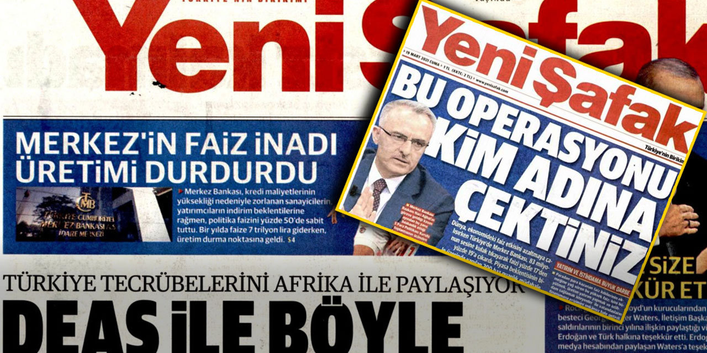

## Türkiye Cumhuriyet Merkez Bankası Para Politikasının Maradona’sı mı?

Diego Maradona’nın 1986 Dünya Kupası’nda İngiltere’ye karşı oynadığı maç, sadece dramasıyla değil, attığı birbirinden tamamen farklı iki efsanevi golle de futbol tarihine kazınmıştı. O gollerden biri malum, hakemi ve milyonları kandıran, kurnaz, kural dışı “Tanrı’nın Eli” golüydü. Diğeri ise Maradona’nın İngiliz savunmasını 60 metre boyunca peşinden sürüklediği ve beş altı şaşkın oyuncunun kendisini aldatmak için hamle yapmasını beklerken düz bir hat üzerinde ilerlediği muhteşem [koşusuydu](https://www.youtube.com/embed/Da_CDPRG2j0?si=1lI8ImoU0skfWVis&amp;start=50). Bu koşu sonrası attığı gol futbol tarihine 100 yılın golü efsanevi golü olarak geçti. Aslında Maradona aşağı yukarı düm düz koşmuştu ve fakat bu tahmin edilemezdi - tıpkı modern para politikaları gibi.  

<small></small>

Ve son zamanlarda Türkiye’nin para politikalarına bakıldığında, bu Maradona büyüsünün bir yansımasını görmek zor değil: hatalar ve yanıltıcı adımların ardından disiplinli, stratejik bir sprint var gibi görünüyor. Yıllarca özellikle de Nureddin Nebati--Şahap Kavcıoğlu döneminde Türkiye Cumhuriyet Merkez Bankası, ekonomik ortodoksluğun kurallarını esnetmeye çalışan, ne yapmak istediği nereye varmak istediği anlaşılmayan sıradışı bir yaklaşıma sıkıştı kaldı. Cumhurbaşkanı Erdoğan’ın yüksek faiz oranlarının enflasyona neden olduğuna (onu dizginleyeceğine değil) dair ısrarı, enflasyon hızla artarken agresif faiz indirimlerine yol açtı. Sonuç? Değer kaybeden lira, yükselen fiyatlar ve ekonomik kaos. Özetle, Türkiye’nin merkez bankası  eliyle yürüttüğü ve milyonlarca insan üzerinde yaptığı deney başarısız oldu.

Bu dönem, Maradona’nın **“Tanrı’nın Eli”** oyununa benzetilebilir - cüretkar, alışılmadık ve riskli. Dünya, bu deneyi yani Türkiye’nin enflasyonunun neredeyse %100’e fırlamasını, tasarrufların erimesini ve günlük maliyetlerin neredeyse katlanılamaz hale gelmesini merakla seyretti. Bu yüksek riskli bir oyundu ve hakem - piyasa - aldatılmadı. Merkez bankasının kumarı krize doğru ilerledi ve hangi açıdan bakılırsa bakılsın krizin kötü sonuçlarını başta vatandaş olmak üzere tüm piyasa bunu tecrübe etti. 

Ancak, tıpkı Maradona’nın ikinci golü gibi, Türkiye Cumhuriyet Merkez Bankası da farklı bir vitese geçmiş görünüyor. New York Fed eski ekonomisti ve yeni başkan Fatih Karahan yönetiminde, banka daha ortodoks yeni bakan Mehmet Şimşek’in tabiri ile 'akılcı' bir yaklaşıma yöneldi. Kısa vadede acı çekmek pahasına faiz oranlarını artırdı. Maradona’nın beklentileri boşa çıkaran düz koşusu gibi, Türkiye şimdi piyasalara ekonomiyi istikrara kavuşturma konusunda ciddi olduğunu sinyallerle gösteren net ve istikrarlı bir yol izliyor. Eylül 2024’te, bir yılı aşkın süredir ilk kez enflasyon %50’nin altına düştü - bu yeni taktiklerin sonuç vermeye başladığının kanıtı.

<small></small>
<figcaption style="text-align: center; font-size: small;">Yeni Şafak gazetesinin merkez bankasına politikalarına dair manşetleri!</figcaption>

## Maradona Etkisi ve Modern Para Polikalar

Para politikası ile Maradona arasında yapılan bu benzetme, [eski İngiltere Merkez Bankası Başkanı Mervyn King tarafından ortaya atılmıştı](https://www.bankofengland.co.uk/-/media/boe/files/speech/2005/monetary-policy-practice-ahead-of-theory). King’in **“Maradona Etkisi”**, merkez bankalarının ekonomileri sürekli müdahale ile değil, beklentileri yöneterek nasıl etkileyebileceğini dile getirmek için ortaya atılmıştı. Maradona’nın düz koşusunun defansı zigzag yapacağını düşünmeye nasıl ittiyse, merkez bankaları da piyasaları büyük politika değişiklikleri yapmadan gelecek eylemleri konusunda ikna ederek istikrar sağlayabilir. Aksi halde Amerika merkez bankası eşki başkanı nobelli iktisatçı Ben Bernanke’nin dediği gibi  merkez bankası 'hall of mirrors' (birbirini tekrar eden aynalı salon) çıkmazına düşer ve bu kısır döngüden çıkmak yine ve daha acı reçeteler gerektirir.

Türkiye için, merkez bankası şimdi benzer bir meydan okumayla karşı karşıya. Faiz oranlarını artırmaya odaklanmalarının başlangıçtaki tepkisi olumlu oldu; enflasyon düşmeye başladı ve lira toparlanma belirtileri gösteriyor. Ancak gerçek test, özellikle faiz oranlarını yeniden düşürme yönünde siyasi (bakınız yenişafak manşetleri gibi) baskılar altında bu momentumu sürdürebilmek olacaktır. Tıpkı Maradona’nın koşusu gibi, bu işin anahtarı doğru yolu izlemek, erken sağa sola sapma cazibesine kapılmamak ve piyasanın güvenini korumaktır.

## İnce Çizgide Yürümek: Futboldan Dersler

Türkiye Cumhuriyet Merkez Bankası hassas bir dengeyi korumak zorunda. Faiz oranlarını çok erken indirirse, önceki kontrolsüz enflasyonun tekrarı riski ortaya çıkacağı çok net. Maradona’nın savunmacılardan kaçınmak için düz bir hat üzerinde ilerlemek zorunda olması gibi; Türkiye’nin merkez bankacıları da gevşek politikalara yönelme çağrılarına kulak asmadan gözlerini fiyat istikrarı hedefinden ayırmamalıdır.

Merkez bankacıların da söyleyeceği gibi, güvenilirlik her şeydir. **Piyasalar bir merkez bankasının enflasyonla mücadelede kararlı olduğuna inandığında, agresif eylemler olmadan bile istikrar yaratabilir.** Maradona Etkisi’nin özü budur: güvenilirlik yoluyla etki yaratmak. Türkiye Cumhuriyet Merkez Bankası, yatırımcıları ve vatandaşları enflasyonu dizginleme misyonunda kararlı olduğuna ikna edebilirse, sürekli faiz artışlarına duyulan ihtiyaç azalabilir.

## Önümüzdeki Yol Haritası: Aynı Kararlılıkla Devam

Son gelişmeler Türkiye için daha iktisadi olarak parlak bir geleceğe işaret ediyor. Türk lirasına olan güven dikkatle yeniden inşa ediliyor, enflasyon soğuyor ve yatırımcılar biraz daha rahat nefes alıyor. Ancak bu geri dönüş hikayesini kalıcı bir hale getirmek için, Türkiye’nin merkez bankası tutarlı ve net olmalıdır. Maradona’nın, diğer herkesin kendisini sorgularken düz bir hat üzerinde koşması gibi, onların da stratejilerini sıkı tutmaları ve hedeflerine odaklanmaları gerekir.

Türkiye’nin para politikası yolculuğu, net ve disiplinli politikanın gücünü - ve saptığında ortaya çıkan kaosu - çarpıcı bir şekilde hatırlatıyor. Merkez bankası, kendi “düz koşusunu” başarıyla yönetebilirse, uzun vadeli istikrar için bir gol atabilir. Beklentileri yönetme ve kesin eylemler karışımından oluşan Maradona Etkisi bir oyun planı sunuyor. Şimdi, Türkiye Cumhuriyet Merkez Bankası’nın bu planı uygulaması ve belki de Maradona gibi eleştirmenlerini şaşırtması gerekiyor.

