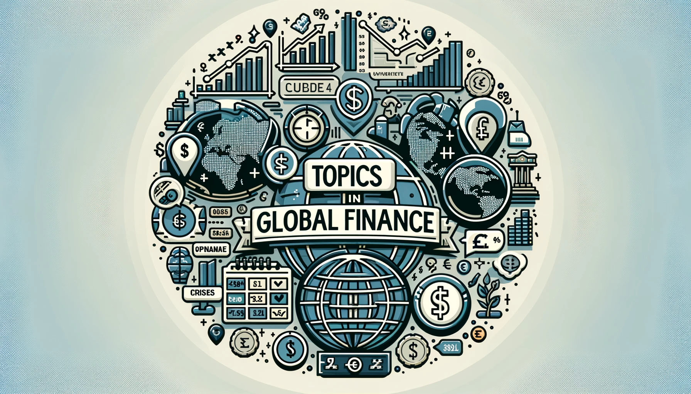

<small></small>

## Table of contents

## Topics

- Globalisation, Global Finance, Global Imbalances ≈ Lecture 1
- Intertemporal Theory of Current Account ≈ Lecture 2
- Dynamics of Small Open Economies and CA Sustainability ≈ Lecture 3
- Equilibrium in Financial Markets and Capital Controls ≈ Lecture 4
- International Financial Integration: Models, Evidence, Debates ≈Lecture 5
- Risk Sharing, Integration, and the Transmission of Shocks ≈ Lecture 6
- Balance of Payment Crisis ≈ Lecture 7
- Banking, Banking Crises ≈ Lecture 8
- Sovereign Debt Crises ≈ Lecture 9

### Course Introduction Video - (2021)

 <small>I recorded this video during the covid-19 in 2021 but still usefull. [Click to watch](https://www.youtube.com/watch?v=OazQ0H7FAUk) </small> 

## Organisation

The course will be divided into two parts. The first part of the course will focus on the effects of financial integration and the international transmission of shocks. We will use mathematical tools and theoretical models to understand some major policy debates in international finance, including the determinants and consequences of global imbalances. The second part of the course examines the causes and consequences of financial crises, with a focus towards understanding current events in the global economy and global banking. We will analyze theories of financial crises, with the objective of understanding the causes of crises and analyzing policy responses.

### Approach:

The course will focus on the effects of financial integration and the international transmission of shocks. We will use theoretical models to understand some major policy debates in international finance, including the determinants and consequences of global imbalances. Furthermore, the course examines the causes and consequences of financial crises, with a focus towards understanding current events in the global economy. We will analyse various theories of financial crises, with the objective of understanding the causes of crises and analysing policy responses.

### Prerequisites

- An undergraduate-level understanding of economics/finance knowledge is assumed.
- Basic knowledge of calculus, linear algebra, and probability theory is required.

### Class Policy

- Regular attendance is essential and expected.

### Grading Policy:

- The module is examined in a two and half hour written exam in May (80%) and one 1-hour end-of-term test (20%).
- The end-of-term test will be held on March 18th (Check the date and time again).
- End of term test will cover all topics covered in lectures from week 16 to 22.
- All topics covered up to week 24 (including) will be included in the final exam in May.

## Course Outline

### Principal Aims:

The aim of the module is to equip students with a variety of theoretical and econometric tools and knowledge to study and understand key issues in global finance and to analyse policy responses. It departs from standard theoretical models of international finance and uses mathematical tools and econometric methods to build up from these models and to assess complex issues relating to the global finance. The first objective is to introduce a set of issues and questions that are central to modern finance and macroeconomics, and that are genuinely interesting, such as: To provide students with the opportunity to understand the core theoretical models used in international macroeconomics, for both closed and open economies, and how to use them to enhance their comprehension of real-world macroeconomic experiences, especially involving macroeconomic and financial policy.

### Principal Learning Outcomes:

By the end of the module, the student should have the theoretical and empirical tools and knowledge to understand current academic and policy debates in international finance. In addition, it is expected that the student will have an understanding of a wide variety of theoretical models commonly used in global finance; an ability to present clearly and methodically in their own words, also using equations and diagrams as appropriate; an understanding of the relationship between different models, and how to apply them in the analysis of recent global finance episodes and policy discussions affecting actual economies and business world.

### Intellectual and Practical Skills:

- The ability to analyse facts and circumstances to determine the cause of a problem and identifying and selecting appropriate solutions.
- Conceptual and critical thinking, analysis, synthesis, and evaluation.
- Numeracy and quantitative skills to manipulate data, evaluate, estimate, and model business problems, functions, and phenomena.
  <!-- <video autoplay loop="loop" muted="muted" plays-inline="true">
  <source src="https://github.com/satnaing/astro-paper/assets/53733092/18fdb604-1ca3-41a0-8372-1367759091ff" type="video/mp4">
  <!-- <source src="/assets/docs/astro-paper-v3-view-transitions-demo.mp4" type="video/mp4">  </video> -->

## Required Readings:

There is no textbook for this course. The required readings consist of a collection of book chapters, journal articles, and working papers. Note that these readings may be subject to change. I will post the required readings before each class on the course website. The reading list includes many non-required readings. These are intended for those students that would like to deepen their understanding of a topic, particularly those that may be interested in working on the topic for their dissertation.

### Main References

The course is based on lecture notes/slides which will be posted in course page prior to the lectures. Participation in lectures together with studying the lecture notes, is sufficient to succeed on the course. The lecturer will make available all the slides used in lectures. There is no additional compulsory reading but here is the list of various interesting and useful books that will be touched during the course. In addition to book a number of journal articles are assigned readings and will be made available through the course website. Most of these articles are accessible introductions to a topic.

- Intermediate Macroeconomics, Eric Sims; Julio Garin; and Robert Lester - [FREE(for now) Textbook](https://www3.nd.edu/~esims1/gls_textbook.html).
- Foundations of International Macroeconomics, Maurice Obstfeld; Kenneth Rogoff, MIT Press, 200

- **Intermediate Macroeconomics**, Eric Sims; Julio Garin; and Robert Lester - [FREE (for now) Textbook](https://www3.nd.edu/~esims1/gls_textbook.html).
- **Foundations of International Macroeconomics**, Maurice Obstfeld; Kenneth Rogoff, MIT Press, 2004.
- **International Macroeconomics**, Stephanie Schmitt-Grohe, Martin Uribe and Michael Woodford, Princeton University Press - in Press - FREE Copy: [Textbook Manuscript (in PDF format)](http://www.columbia.edu/~mu2166/UIM/suw.pdf).
- **The Economics of Exchange Rates**, Lucio Sarno and Mark P. Taylor, Cambridge University Press, 2012: [Textbook](https://doi.org/10.1017/CBO9780511754159).
- **International Finance and Open-Economy Macroeconomics**, Springer Press, 2016: [Textbook](https://www.springer.com/gp/book/9783662498606).
- **What Have We Learned?: Macroeconomic Policy after the Crisis**, George A. Akerlof, Olivier Blanchard, David Romer, and Joseph E. Stiglitz, MIT Press, 2014.
- **International Finance: Theory and Policy**, Paul Krugman, Maurice Obstfeld, Marc Melitz, Pearson, 2018.
- **Macroeconomics: Institutions, Instability, and the Financial System**, Wendy Carlin, David Soskice, Oxford University Press, 2014.

### Main Required Reading:

- Schmitt-Grohé, Stephanie and Uribe, Martín and Woodford, Michael, "International Macroeconomics." Textbook manuscript, Columbia University, 2012. [Chapter 1-3]
- Ortiz-Ospina, Esteban and Beltekian, Diana and Roser, Max, "Trade and globalization," Our World in Data, 2018. [A very good data-based information]
- Peterson Institute for International Economics, "What Is Globalization?", 2018. [Watch the video](https://www.piie.com/microsites/globalization/what-is-globalization)
- Chinn, M, "Global imbalances," The evidence and impact of financial globalization, volume 3, pages 67–79, Elsevier Inc. Oxford, 2013.
- Obstfeld, Maurice and Rogoff, Kenneth, "Global imbalances and the financial crisis: products of common causes," CEPR Discussion Paper No. DP7606, 2009.
- Alfaro, Laura and Kalemli-Ozcan, Sebnem and Volosovych, Vadym, "Sovereigns, upstream capital flows, and global imbalances," Journal of the European Economic Association, volume 12, number 5, pages 1240–1284, Oxford University Press, 2014.
- Bekaert, Geert and Harvey, Campbell R and Lundblad, Christian, "Financial openness and productivity," World Development, volume 39, number 1, pages 1–19, Elsevier, 2011.
- Feldstein, Martin and Horioka, Charles, "Domestic savings and international capital flows," National Bureau of Economic Research, 1979.
- Lucas, Robert E, "Why doesn't capital flow from rich to poor countries?", The American Economic Review, volume 80, number 2, pages 92–96, JSTOR, 1990.
- Varela, Liliana, "Reallocation, competition, and productivity: evidence from a financial liberalization episode," The Review of Economic Studies, volume 85, number 2, pages 1279–1313, Oxford University Press, 2018.
- Arezki, Rabah and Ramey, Valerie A and Sheng, Liugang, "News shocks in open economies: Evidence from giant oil discoveries," The quarterly journal of economics, volume 132, number 1, pages 103–155, Oxford University Press, 2017.
- Forbes, Kristin, "The UK Current Account Deficit: Risky or Risk-Sharing," Speech given at the Official Monetary and Financial Institutions Forum, London, March 2016.
- Curcuru, Stephanie E and Thomas, Charles P and Warnock, Francis E, "On returns differentials," Journal of International Money and Finance, volume 36, pages 1–25, Elsevier, 2013.
- Rey, Helene and Gourinchas, Pierre-Olivier, "External Adjustment, Global Imbalances and Valuation Effects," 2013.
- Eaton, Jonathan and Gersovitz, Mark, "Debt with Potential Repudiation: Theory and Estimation," Review of Economic Studies 48, pages 289–309, 1981.
- Panizza, Ugo and Sturzenegger, Federico and Zettelmeyer, Jeromin, "The economics and law of sovereign debt and default," Journal of economic literature, volume 47, number 3, pages 651–98, 2009.
- Tomz, Michael and Wright, Mark LJ, "Empirical research on sovereign debt and default," Annu. Rev. Econ., volume 5, number 1, pages 247–272, Annual Reviews, 2013.
