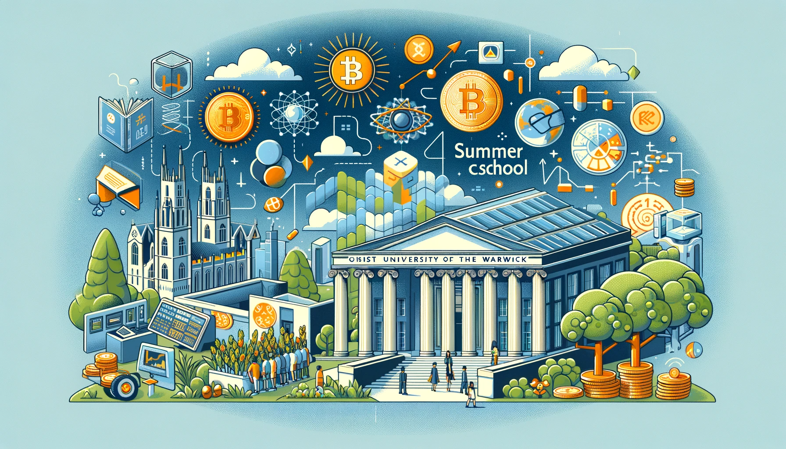

I teach an engaging summer school course at the University of Warwick, specifically tailored for about 200 pre-university students from across the world. This course covers three significant areas: the evolving landscape of digital currencies like Bitcoin and their potential to redefine traditional monetary systems; the vital role of central banks in addressing the global climate crisis and maintaining financial stability; and the impact of big financial data, AI, machine learning, and algorithmic trading on financial markets. Each topic is designed to provide students with a comprehensive understanding of current and emerging trends in finance and economics, equipping them with insights into the challenges and opportunities in today's interconnected financial world.

<small></small>

#### Bitcoin, cryptocurrency, central bank digital currency: Will Bitcoin become the money of the future?

In each single day, people around the world make more than 2 billion digital payments. Each of these transactions rely on the monetary system – the set of institutions and arrangements that surround and support monetary exchange. In other words a centralised system. This centralised system with the central bank at its centre has served society well. Yet digital innovation is expanding the frontier of technological possibilities, placing new demands on the system. Many believe that Bitcoin will replace the dollar and will be the money of the future. We will try to answer this question by considering other cryptocurrency and financial technology by comparison todays financial markets.

#### Global Climate Crises and Financial Stability

The era of one policy objective –inflation targeting– and one tool – interest rates – is over for the central banks for the sake of financial stability. Today, there are many challenges that central banks have to face and climate crisis is at the top of the list. To deliver financial stability in a world that is now so financially interconnected poses fresh challenges such as climate risk and recent pandemic which affects the two policy goals pursued by central banks, financial and monetary stability. Central banks need to not just adapt to changing conditions but equip new tools too. In this theme, we are going to understand the channels and efficiency of central banks climate change policy over the world. Since, an effective monetary policy (green central banking) can help to shape the works of financial market and increase the policy effectiveness.

#### Big Financial Data, AI, Machine Learning and Algorithm Trade.

Big financial data refers to large, diverse and complex data sets that has a potential to provide solutions to long-standing business challenges. In other words, big data is completely revolutionising in many different areas for the financial world. In this course we are going to look at how financial institutions can use real time big data to improve the ability for dealing with fraudulent activities, or how the functioning of financial markets will be changed. For example, trade pattern in stock exchanges all around world are going to be affected by algorithm trade by utilising high frequency data.
